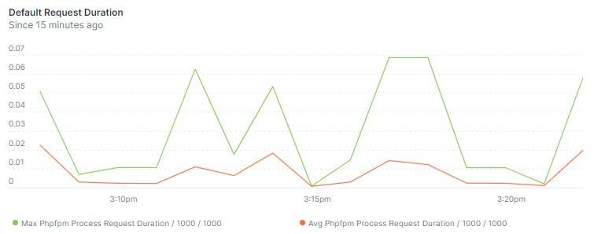

# Dokuwiki in Docker


## About
This repository contains the `Dokuwiki in Docker` image.


Get a Dokuwiki installation with a website in a single line of command.

## Example: Starter Web Site

To get a [Dokuwiki server](https://dokuwiki.org) with the [Combostrap Starter Site](https://github.com/ComboStrap/site-starter) available at http://localhost:8080, execute:
```bash
docker run \
  --name combo-site-starter \
  --rm \
  -p 8081:80 \
  -e DOKU_DOCKER_GIT_SITE='https://github.com/ComboStrap/site-starter' \
  ghcr.io/combostrap/dokuwiki:php8.3-latest
```

## Table of Content

The table of content (TOC) is available on GitHub at the right corner of this document.


## Features

You got out of the box:
* [Website instance](https://combostrap.com/admin/combostrap-website-5gxpcdgy)
  * You can:
    * [disable it](#disable-automatic-default-starter-website-installation)
    * or [set your own](#git-pull-mode---set-your-combostrap-git-website)
* [Nice URL rewrite ](https://www.dokuwiki.org/rewrite)
* [Automatic Search Index Update](#how-to-disable-the-automatic-update-of-the-search-index)
* [Automatic Plugins Installation](https://combostrap.com/admin/combostrap-website-yolv2qw6#plugins)
* SEO Ready: [SiteMap Enabled by default to 5 days](https://combostrap.com/seo/combostrap-seo-sitemap-saio2v87#enable)
* [Healthcheck Endpoint](#get-healthcheck--liveness--probes--container-state)
* [Metrics Endpoint](#how-to-monitor-dokuwiki-docker)
* [Last Patches](resources/dokuwiki-docker/meta/dokuwiki-patches)
* [Dev Mode](#set-in-dev-mode)
* [Proxy Ready](#is-the-docker-image-proxy-ready) (to report the real ip behind a proxy)
* [Maintenance Ready](#how-to-clean-up-a-dokuwiki-instance-maintenance)
* [Out-of-Memory error protection with a Dedicated Pages Processing Pool and max request configuration](#configure-php-fpm-pool)
* [Crawl/Scan protection with rate limiting](#how-to-define-the-rate-limit-for-pages)
* [Git Ready](#how-to-git) with 2 mode of developments:
  * [Pull Mode](#git-pull-mode---set-your-combostrap-git-website)
  * [Push Mode](#git-push-mode)
* Request Performance:
  * [Php Fpm](https://www.php.net/manual/en/install.fpm.php) - php instance pooling
  * [OpCache](https://www.php.net/manual/en/book.opcache.php) - php compilation cache
  * [Pages and Media Thread Pool](#configure-php-fpm-pool) - dedicated pool separated between pages and media requests 

Max and average request durations of [Combostrap](https://combostrap.com) from the [monitoring dashboard](#monitoring-php-fpm-dashboard)



## How to

### Set an admin user

By default, a site will run with the `readonly` ACL policy.
The site cannot be edited at all.

If you want to set an admin user, you need to set the following variables:
* `DOKU_DOCKER_ACL_POLICY` to `public`: the policy applied
* `DOKU_DOCKER_ADMIN_NAME` to the user admin name
* `DOKU_DOCKER_ADMIN_PASSWORD` to the user admin password
* `DOKU_DOCKER_ADMIN_EMAIL` to the user admin email (Optional)

Example:
```bash
docker run \
  --name combo-site-starter \
  --rm \
  -p 8081:80 \
  -e DOKU_DOCKER_ACL_POLICY='public' \
  -e DOKU_DOCKER_ADMIN_NAME='admin' \
  -e DOKU_DOCKER_ADMIN_PASSWORD='welcome' \
  -e DOKU_DOCKER_ADMIN_EMAIL='admin@example.com' \
  -e DOKU_DOCKER_GIT_SITE='https://github.com/ComboStrap/site-starter' \
  ghcr.io/combostrap/dokuwiki:php8.3-latest
```

The above command:
* publish the [ComboStrap default install website](https://github.com/ComboStrap/site-starter)
* and configure it with the admin user:
  * name `admin`
  * password `welcome`
  * email `admin@example.com`


### Mount a Volume

You may mount a [volume](#why-the-volume-contains-a-whole-dokuwiki-installation) 
to keep your installation intact between restart.


Example:
* Desktop Linux / Windows WSL
```bash
cd ~/your-site
docker run \
  --name combo-site-starter \
  --rm \
  --user 1000:1000 \
  -p 8081:80 \
  -v $PWD:/var/www/html \
  ghcr.io/combostrap/dokuwiki:php8.3-latest
```
* On Windows, don't bind mount a local directory as volume. See [perf](#poor-windows-perf-with-local-directory-volume)

On a desktop, Dokuwiki would be available at: http://localhost:8081 

Note: If the [volume](#why-the-volume-contains-a-whole-dokuwiki-installation) is empty, after the run, it will be filled
with a new dokuwiki installation.

### Choose the installed dokuwiki version

You can choose the initial [version](https://github.com/dokuwiki/dokuwiki/releases) 
to install via the `DOKUWIKI_VERSION` environment.

Example with the [2024-02-06b "Kaos" release](https://github.com/dokuwiki/dokuwiki/releases/tag/release-2024-02-06b)
```bash
docker run \
  --name combo-site-starter \
  --rm \
  -p 8081:80 \
  -e DOKUWIKI_VERSION=2024-02-06b \
  ghcr.io/combostrap/dokuwiki:php8.3-latest
```

### Get Healthcheck / Liveness / Probes / Container State

If you wish to set a healthcheck point, you may use:
* the dokuwiki ping endpoint `/dokuwiki-docker/ping.php` (ie [ping.php endpoint](resources/dokuwiki-docker/meta/status/ping.php))
* or the php-fpm endpoint `/php-fpm/doku/ping` (ie to the `ping.path` and `ping.response` [configurations](resources/conf/php-fpm/pages.conf))

Note that:
* if the [page php-fpm](#configure-php-fpm-pool) is full because there is too much request (bots or visitors), 
the dokuwiki ping will fail while the php-fpm endpoint will not
* if you want more control on `php-fpm`, you can create your own image and use the [php-fpm-healthcheck](https://github.com/renatomefi/php-fpm-healthcheck)

Example:
* in docker: the `HEALTCHECK` is already defined in the [Dockerfile](Dockerfile)
* in a Kubernetes manifest
```yaml
containers:
  - name: container-name
    # Startup Probe: Used to check if the application has started before starting the other probes
    # periodSeconds * failureThreshold = 10 * 10 = 100 seconds to starts
    startupProbe:
      httpGet:
        path: /dokuwiki-docker/ping.php
        port: 80
      # 5 seconds after the start
      initialDelaySeconds: 5
      # The probe is performed every 55 second
      periodSeconds: 10
      # after 3 failed prob, the container is considered unhealthy.
      failureThreshold: 10
      # after 1 successful prob, the container is considered healthy.
      successThreshold: 1
    # Readiness Probe: Checks if the app is ready to serve traffic.
    # If it fails, the pod is removed from the service endpoints.
    # Used also in rollout
    readinessProbe:
      httpGet:
        path: /dokuwiki-docker/ping.php
        port: 80
      initialDelaySeconds: 5
      periodSeconds: 10
      failureThreshold: 3
      successThreshold: 1
    # livenessProbe Probe
    # If it fails, the pod is restarted
    livenessProbe:
      httpGet:
        path: /dokuwiki-docker/ping.php
        port: 80
      initialDelaySeconds: 5
      periodSeconds: 10
      failureThreshold: 3
      successThreshold: 1
```


### Disable Automatic Default Starter WebSite Installation

By default, this image will [install the default Starter ComboStrap WebSite](https://combostrap.com/admin/combostrap-website-5gxpcdgy#default_website)
automatically after the initial Dokuwiki Installation.

To disable this behavior, you need to set the `DOKU_DOCKER_STARTER_SITE` environment variable to `false`

```bash
docker run -e DOKU_DOCKER_STARTER_SITE=false
```


### Set in dev mode

By default, this image will run `php` in production mode.
You can set it in dev mode via the `DOKU_DOCKER_ENV` to see warning 
and other alerts.

Example:
```bash
docker run -e DOKU_DOCKER_ENV=dev ....
```

### Configure Php

Php can be configured via environment variables.

The convention is that you need to:
* capitalize the configuration name 
* replace all separator by `_`
* and add `PHP_` as prefix.

For instance for the `date.timezone`, you need to set the `PHP_DATE_TIMEZONE` environment.  
```bash
docker run -e PHP_DATE_TIMEZONE=UTC ....
```

All actual possibles configurations can be seen in the [php dokuwiki-docker.ini files](resources/conf/php/dokuwiki-docker.ini)

### Configure Php-Fpm Pool

Php-Fpm runs 2 pools of threads:
* `pages`: with the highest priority, for page rendering (ie doku.php and css.php)
* `www` (default): with the lowest priority, for all other requests (image, media, ...)


You can configure them with the following environment variables.
```bash
# Doku Pool (Pages)
PHP_FPM_PM_PAGES_MAX_SPARE_SERVERS=1 # the minimum number of thread in idle
PHP_FPM_PM_PAGES_MAX_SPARE_SERVERS=2 # the maximum number of thread in idle
PHP_FPM_PM_PAGES_MAX_CHILDREN=3 # the maximum number of threads
PHP_FPM_PM_PAGES_MAX_REQUESTS=500 # Number of requests processed before restart (0 means no restart)
PHP_FPM_PM_PAGES_MEMORY_LIMIT=128M # The maximum amount of request memory (the php default)
# WWW Pool (Default, media)
PHP_FPM_PM_WWW_MIN_SPARE_SERVERS=2
PHP_FPM_PM_WWW_MAX_SPARE_SERVERS=3
PHP_FPM_PM_WWW_MAX_CHILDREN=4
PHP_FPM_PM_WWW_MAX_REQUESTS=500
PHP_FPM_PM_WWW_MEMORY_LIMIT=384M # 384 and not 128 because of the taskrunner indexing 
```

The pages pool has less thread than the default pool 
because for one page, you ask much more resources (one or more image, ...).

How to use? For instance for the `max.children` number of threads for the `doku` pool, 
you would need to set the `PHP_FPM_PM_PAGES_MAX_CHILDREN` environment.

To change it from `3` to `4`
```bash
docker run -e PHP_FPM_PM_PAGES_MAX_CHILDREN=4 ....
```

The pool configuration will result in a low or high memory usage.
See the [dedicated section](#calculate-the-memory-capacity-sizing)

The environment variables are used in their corresponding files:
* [Doku pool (pages)](resources/conf/php-fpm/pages.conf)
* [Default pool (media)](resources/conf/php-fpm/www.conf)

Note: The priority of the pool was set via the `process.priority` php-fpm configuration
but is no more used because it kills pod to pod network communication on Kubernetes.


### Calculate the Memory Capacity Sizing

The total memory is memory taken by the php code:
* at rest 
* at request time 


#### Memory at rest

Memory at rest is the space taken by all php classes loaded in memory.

Below is an example of a `221Mb` container after a load of 4 bots downloading the whole Combostrap website 
with the default sizing:
* 1 [pages threads](#configure-php-fpm-pool)
* 2 [default thread](#configure-php-fpm-pool)
```
32 MB php-fpm: master process
37 MB php-fpm: pool doku
34 MB php-fpm: pool www
34 MB php-fpm: pool www
54 MB caddy run -c
30 MB /usr/bin/python3 /usr/bin/supervisord -c
```

You can configure the [maximum number of php-fpm children threads](#configure-php-fpm-pool)
to manage the maximum memory size.

You can count:
  * 40MB by [thread](#configure-php-fpm-pool)
  * 35MB for the master php-fpm thread
  * 60MB for the Caddy web server
  * 30MB for the process controller (supervisor)

#### Memory at request time

The `memory limit` is the memory that the php request will use.

The default value is defined by [pool](#configure-php-fpm-pool):
* `128Mo` for the pages pool (the [default dokuwiki value is 256M](https://github.com/dokuwiki/docker/blob/main/Dockerfile#L12))
* `384Mo` for the default pool (due to the dokuwiki task runner that needs to load index)

You may increase this values in the [pool configuration](#configure-php-fpm-pool)

They are maximum, the memory used on a request by request basis are way lower
* between 2 and 30M for a [large wiki](#how-to-install-and-configure-a-large-wiki)
* between 2 and 7M for a normal wiki.

Example of a large wiki:


Why? Because dokuwiki loads the images and index in memory for processing.

### Test a load

You can test your website by download it with `wget`

Example:
```bash
WEBSITE_URL=https://combostrap.com # replace with your URL
wget --recursive --level=inf --no-parent --timestamping --quiet --show-progress --output-file=wget-log.txt "$WEBSITE_URL"
```

If you start this command `4` times, you would fake `4` bots, crawling your website.


### Get Php Info Endpoint

To see the actual configuration, you can hit the endpoint: 

http://localhost:8081/dokuwiki-docker/phpinfo.php

This endpoint is protected by the admin user credentials. 
If you want to get access, you need to [set the admin user](#set-an-admin-user)


### Run as the host user

By default, the container will run as `root` but 
if you [mount a volume](#mount-a-volume) from your desktop, 
you may want to change the user to the host user 
to not get any permission issues.

You do it by setting the `user` option.

```bash
# check your ids (uid:gid)
# By default, the first user is 1000:1000
# and was created with the name `me`
id
# then use them
docker run \
  --user 1000:1000 \
  --rm \
  -p 8081:80 \
  ghcr.io/combostrap/dokuwiki:php8.3-latest
```

### Get a Bash Shell in the container

Example:
```bash
docker exec -ti your-container-name bash 
# example
docker exec -ti combo-site-starter bash
```

Note that you get the same environment as the running container
thanks to the [bash.bashrc](resources/conf/bash/bash.bashrc) located at `/etc/bash.bashrc`.

### Change the savedir configuration

If you want to use `data` has a namespace (ie `https://example.com/data/yourpage`), you can't 
by default because the [savedir](https://www.dokuwiki.org/config:savedir) 
is forbidden for security reasons by the [web server](resources/conf/caddy/Caddyfile)

To use `data` as a namespace, you need to
* rename the directory `data` to `dokudata`
* set the `savedir` configuration to `dokudata` in your `conf/local.php` file
```php
$conf['savedir'] = './dokudata';
```
* set the environment `DOKU_DOCKER_SAVE_DIR` to `dokudata` in a `docker run`
```bash
docker run \
  -e DOKU_DOCKER_SAVE_DIR='dokudata' \
  ghcr.io/combostrap/dokuwiki:php8.3-latest
```

Note: You can change the `dokudata` value to whatever you want.

### Update the Docker image

We support for now only one tag by php version, therefore you need to delete the image before pulling it again

Example for `php8.3`
```bash
docker rmi ghcr.io/combostrap/dokuwiki:php8.3-latest
docker pull ghcr.io/combostrap/dokuwiki:php8.3-latest
```


### How to disable the automatic update of the search index

When a pod/container is starting the [Search Index](https://www.dokuwiki.org/search#some_background_on_the_searchindex)
is updated, otherwise any search or [Combo SQL](https://combostrap.com/templating-markup/how-to-define-your-data-set-with-sql-55fkwj0m)
would not return any data.

If you wish to disable this automatic update, you need to set the environment variable  `DOKU_DOCKER_SEARCH_INDEX` to `off`

Example:
```bash
docker run \
  -e DOKU_DOCKER_SEARCH_INDEX='off' \
  ...
```

You can then update it with the `comboctl` tool.

Example with the [starter site](#example-starter-web-site)
```bash
docker exec -ti combo-site-starter comboctl index
```

Note on Performance:
* In case of rollout, this extra processing should not impact the availability of your container if you set the [readiness probes](#get-healthcheck--liveness--probes--container-state)
* If the rollout takes too long, you need to set up a [volume](#mount-a-volume) so that the index is only updated and not created from scratch.

### How to clean up a Dokuwiki Instance (maintenance)?

Dokuwiki creates a lot of temporary files that needs to be removed periodically to keep
the size on the disk small. 


The `DokuWiki Docker` image contains the [comboctl cli](resources/comboctl/bin/comboctl) `cleanup` function  
to do exactly that.

You can execute it like that. 
Example with the [starter container name](#example-starter-web-site):
```bash
docker exec \
  -e BASH_ENV=/etc/bash.bashrc \
  combo-site-starter \
  bash -c 'comboctl cleanup' 
```

It will:
* Purge the cache
* Purge the attic (old revisions)
* Purge the locks
* Purge the sqlite log of [Combo cache](https://combostrap.com/docs/cache-management-j4mipb56) and [Router Redirections](https://combostrap.com/docs/combostrap-request-router-venrychc)
* Clean the meta (pages and media) directories. It ensures that there is one meta, changes or indexed file by page or media.


You can control the retention days with the following environment variables:
* `DOKU_DOCKER_CLEAN_CACHE_RETENTION_DAYS`: the retention days for the cache (default to 10)
* `DOKU_DOCKER_CLEAN_ATTIC_RETENTION_DAYS`: the retentions days for the old pages revisions (default to 360)
* `DOKU_DOCKER_CLEAN_MEDIA_ATTIC_RETENTION_DAYS`: the retentions days for the old media revisions (default to 90)

Example with the [starter container name](#example-starter-web-site)
```bash
docker exec \
  -e BASH_ENV=/etc/bash.bashrc \
  -e DOKU_DOCKER_CLEAN_CACHE_RETENTION_DAYS=5 \
  -e DOKU_DOCKER_CLEAN_ATTIC_RETENTION_DAYS=90 \
  -e DOKU_DOCKER_CLEAN_MEDIA_ATTIC_RETENTION_DAYS=30 \
  combo-site-starter \
  bash -c 'comboctl cleanup' 
```

The dedicated [Dokuwiki Web Page on maintenance](https://www.dokuwiki.org/tips:maintenance) has more
information on this topic.


### How to define the rate limit for pages?

By default, there is a rate limit of max `2` pages every `1` second.

A human would not click quicker.

You can configure the rate limite for pages via this environment variables:
```bash
DOKU_DOCKER_PAGES_RATE_LIMIT_EVENTS=2 # the number of pages request
DOKU_DOCKER_PAGES_RATE_LIMIT_WINDOW=1s # the window (1s) 
```

Note that if you are behind a proxy, you should be sure to [set it as trusted](#is-the-docker-image-proxy-ready)
otherwise the client would be the proxy, and you would hit the rate limit pretty quickly.

To disable the rate limit, you need to increase the rate limit environment variables.


## Performance

### How to report slow requests?

By default, the image will not report any slow request for the [pages](#configure-php-fpm-pool)

You can enable it by setting the environment variable `PHP_FPM_PM_PAGES_REQUEST_SLOWLOG_TIMEOUT` 
to a period of time.

Example: Setting all pages request above `1s` as slow:
```bash
docker run \
  -e PHP_FPM_PM_PAGES_REQUEST_SLOWLOG_TIMEOUT=1s # ie upper limit of human flow of though
```

Note:
  * A value of '0s' means 'off'.
  * [Php-Fpm request slow log documentation](https://www.php.net/manual/en/install.fpm.configuration.php#request-slowlog-timeout)

The slow request and their trace will be logged into the file `/var/log/php-fpm/pages.slow.log`

### How to install and configure a large wiki

A large wiki is a wiki with a thousand of pages and media.

You will recognize them when the [search index update](#how-to-disable-the-automatic-update-of-the-search-index)
takes a long time to refresh (more than one minute).

Example of a `4.9G` dokuwiki data directory. 
As you can see the `cache` directory is 12 times bigger than the raw data (ie `pages` and `media`)
```
3.5G    ./cache
285M    ./media
184M    ./meta
821M    ./attic
53M     ./pages
26M     ./media_attic
15M     ./index
5.4M    ./media_meta
1.5M    ./log
68K     ./locks
960K    ./tmp
```

With a large wiki, you should:
* [mount a volume](#mount-a-volume):
  * to speed up the download of your site
  * to keep the search index between restart
* [increase the default memory limit of the default pool](#configure-php-fpm-pool)
  * to avoid the [memory error on index building of the task runner](#what-if-the-taskrunner-takes-a-long-time-to-run) 
* [disable search index update](#how-to-disable-the-automatic-update-of-the-search-index)/

Example:
```bash
docker run \
  -e DOKU_DOCKER_SEARCH_INDEX='off' \
  -v $PWD:/var/www/html \
  ...
```

If your data lives in Git, you should consider using [git-lfs](https://git-lfs.com/) to reduce the size of the volume.
Why ? Because otherwise you get your media (images, ...), not once but twice:
* in the `.git` directory 
* and in the working directory (ie `data\media`)

### Poor Windows Perf with Local Directory Volume

On Windows, you should not mount a windows host local directory
because it will be fucking slow.

ie `DON'T` do that
```dos
docker run ^
  -v c:\home\username\your-site:/var/www/html ^
  ghcr.io/combostrap/dokuwiki:php8.3-latest
```

Mounting a Windows folder into a Docker container is always slow no matter how you do it.
WSL2 is even slower than WSL1 in that respect.

See the [related issue](https://github.com/docker/for-win/issues/6742) that explains that this is structural.

The solution is buried into the [Docker WSL best practice](https://docs.docker.com/desktop/wsl/best-practices/)
```
It's recommended that you store source code and other data that is bind-mounted into Linux containers.
``` 

You should then:
* move the site data into the WSL Distro
* and from a Linux shell run:
```bash
docker run \
  -v ~\your-site:/var/www/html \
  ghcr.io/combostrap/dokuwiki:php8.3-latest
``` 

## How to Git

`DokuWiki Docker` supports two developments mode with Git:
* the [pull mode](#git-pull-mode---set-your-combostrap-git-website): you create your pages locally, and you make them public by pulling your Git repository
* the push mode: you create your pages on the server, and you push your changes

### Git: Pull Mode - Set your ComboStrap Git WebSite

In this mode, you would:
* run [DokuWiki Docker locally with a volume mount](#mount-a-volume)
* push your changes to your Git Repository


To publish your website, you would then define the [ComboStrap WebSite](https://combostrap.com/admin/combostrap-website-yfi22ewn)
with the `$DOKU_DOCKER_GIT_SITE` environment variable to a git URL.

Example:
```bash
# https
docker run -e DOKU_DOCKER_GIT_SITE=https://github.com/ComboStrap/site-starter.git
# ssh
docker run -e DOKU_DOCKER_GIT_SITE=git@github.com:namespace/repo.git
```

### Git: Push mode

In Push mode, you will commit and push changes from your Docker container to your Git Repository.

You can make change online from your server container
and push them to your git repository.

To make this happen, you need to perform the following configuration:
* Create a private SSH key and register it in your Git Provider. Example: [GitHub](https://docs.github.com/en/authentication/connecting-to-github-with-ssh)
* At the `run` command
  * Mount the private SSH key with a standard default name (ie for instance `id_ed25519`) in the `~/ssh` directory.
  * Set the Git URI to an SSH one.; ie `git@github.com:namespace/repo.git`, not `https://`
```bash
docker run \
  -e DOKU_DOCKER_GIT_SITE=git@github.com:namespace/repo.git  
  ghcr.io/combostrap/dokuwiki:php8.3-latest
```
* Get into your container / pod
```bash
# docker
docker exec -it containerName bash -l
# Kubernetes
kubectl exec -it podName -- bash -l
kubectl exec -it $(kubectl get pod -l app=appName -o jsonpath='{.items[0].metadata.name}') -- bash -l
```
* The Git Author Info are already set to the admin user and email, but you can change them with the following commands:
```bash
git config --global user.email "you@example.com"
git config --global user.name "Your Name"
```
* You can now use git as normal and push any changes
```bash
git status
git add .
git commit -m "My Commit message"
git push
```

## How to monitor DokuWiki Docker

You can get the php-fpm metrics on the [status page](https://www.php.net/manual/en/fpm.status.php)
for the [2 pools](#configure-php-fpm-pool) at:
* `localhost/php-fpm/pages/status` for the `pages` pool
* `localhost/php-fpm/www/status` for the `default` pool

You can extract them
* via curl
* via an Prometheus exporter

And [graph them](#monitoring-php-fpm-dashboard)


### Monitoring php-fpm with Curl

Example:
```bash
# Pages Pool
docker exec -ti combo-site-starter curl localhost/php-fpm/pages/status?full
# Default Pool (Media, Task Runner...)
docker exec -ti combo-site-starter curl localhost/php-fpm/www/status?full
```
```
pool:                 doku
process manager:      dynamic
start time:           07/Aug/2024:14:04:53 +0000
start since:          173
accepted conn:        21
listen queue:         0
max listen queue:     0
listen queue len:     4096
idle processes:       1
request method:       GET
request URI:          /php-fpm/doku/status?full
content length:       0
user:                 -
script:               /var/www/html
last request cpu:     0.00
last request memory:  0
```

The status endpoint is available only from localhost (ie ip 127.0.0.1) for security reason
therefore you need to run it via `docker exec`

For the documentation over the data and usage, see the [configuration file](resources/conf/php-fpm/www.conf)

### Monitoring php-fpm with Prometheus

You can use the [HiPages php-fpm_exporter](https://github.com/hipages/php-fpm_exporter)
to collect the metrics.

Example as side container in Kubernetes.
```yaml
initContainers:
  - name: php-fpm-exporter
    image: hipages/php-fpm_exporter:2.2.0
    restartPolicy: Always
    env:
      - name: PHP_FPM_SCRAPE_URI
        value: "tcp://127.0.0.1:9000/status,tcp://127.0.0.1:9001/status"
      - name: PHP_FPM_FIX_PROCESS_COUNT
        value: "1"
    ports:
      - containerPort: 9253
```

### Monitoring php-fpm Dashboard

We have created a [new relic](https://newrelic.com) dashboard
that you can get [here](resources/monitoring-graphs/new_relic_dashboard.json).

It's based on:
* the [prometheus exporter metrics](#monitoring-php-fpm-with-prometheus)
* a `service` label that contains the name of your Combostrap Dokuwiki Docker instance. The [kubernetes prometheus operator](https://prometheus-operator.dev/) add it automatically


Example of graph: the max and average request durations of https://combostrap.com


## Docker Image

### Docker Tag

We support for now only one tag by php version, therefore you need to [delete the image before pulling it again](#update-the-docker-image)

```bash
php8.3-latest
```
where:
* `phpX.X` is the php version used
* `latest` is the version of this image


Dokuwiki is installed if not found on the volume.
See [how to choose the installed dokuwiki version](#choose-the-installed-dokuwiki-version)

### Docker Image Components

All images contain :
* [Php-fpm](https://www.php.net/manual/en/install.fpm.php) for php execution
* [Opcache](https://www.php.net/manual/en/book.opcache.php) for php cache compilation
* [Caddy](https://caddyserver.com/docs/caddyfile/directives/php_fastcgi) as webserver
* [Supervisor](http://supervisord.org/) as process manager

### Docker Image List

The list of Docker images is available on [GitHub](https://github.com/ComboStrap/dokuwiki-docker/pkgs/container/dokuwiki)


## How to contribute

If you want to contribute to this image, check the [dev page](doc/dev.md)
that explains how to start the image to develop the script.
 

## FAQ

### Is the Docker Image Proxy Ready?

Yes. By default, this image will trust all proxy that are in a private range.

ie: `192.168.0.0/16 172.16.0.0/12 10.0.0.0/8 127.0.0.1/8 fd00::/8 ::1`

Otherwise, you can set the IP or CIDR of trusted proxy with the `DOKU_DOCKER_TRUSTED_PROXY` environment variable
```bash
# example with a Kubernetes CIDR node where the ingress is installed
DOKU_DOCKER_TRUSTED_PROXY=10.42.1.0/24
```
More information on the value can be found in the [trusted-proxy caddy documentation](https://caddyserver.com/docs/caddyfile/options#trusted-proxies)

Note that the `client_ip` is configured to get the value from these headers:
* `Cf-Connecting-Ip` - Cloudflare Proxy
* `X-Forwarded-For` - Proxy Protocol
* `X-Real-IP`

The [Caddy web access log](#where-is-the-web-access-log-file) also reports the `client_ip` and not the `remote_ip` (ie proxy ip)


### Why the volume contains a whole dokuwiki installation

Why the volume contains a whole dokuwiki installation, and we do not use symlink as [the official image](https://github.com/dokuwiki/docker/blob/main/root/build-setup.sh#L29)
to keep backup data as specified in the [oficial backup documentation](https://www.dokuwiki.org/faq:backup)

Because it's too damn hard to keep the state of an installation.
* Plugins does not use a version/release system.
* You then need to back up the `lib` directory that contains the most code.
* Configuration file may be scattered around. Example:
  * [Inter Wiki Icon](https://www.dokuwiki.org/interwiki#configuring_interwiki_shortcut_icons)
* Identification file are co-located with configuration file in the `conf` directory.
* Runtime data are mixed with persistent data into the `data` directory (ie cache/index/tmp)
* `meta` contains persistent (original data) and runtime metadata (ie derived from the text)

If you want to keep the size low, you need to:
* perform [cleanup administrative task](https://www.dokuwiki.org/tips:maintenance).
* or to create a [site](https://combostrap.com/admin/combostrap-website-5gxpcdgy) without any volume.


### Why my sitemap is not generating URL with https?

DokuWiki detects ssl with the [is_ssl](https://github.com/dokuwiki/dokuwiki/blob/a09f9f21cb0c1d60c498a0945989b20f2b3f00a7/inc/init.php#L543)
function. 

You should make sure that:
* the [trusted proxy conf](https://www.dokuwiki.org/config:trustedproxy) is not empty (By default, it's not)
* the `HTTP_X_FORWARDED_PROTO` header is forwarded if you use a proxy. This image [do it for all proxy in a private range](#is-the-docker-image-proxy-ready).

### Where is the web access log file?

The access log file:
* is located at `/var/log/caddy/access.log`
* has the [Apache Common Log format](https://github.com/caddyserver/transform-encoder?tab=readme-ov-file#apache-common-log-format-example)
* with the real `client_ip` (instead of the `remote_ip`)

## Support

### How to debug a crashing container

By default, in production mode, we don't allow any error to occur otherwise the script terminate.

If you want to allow the container to get up, you need to set:
* strict to `false`
* eventually disable the [search index update](#how-to-disable-the-automatic-update-of-the-search-index)

Example:
```bash
docker run \
  -e DOKU_DOCKER_STRICT=false \
  -e DOKU_DOCKER_SEARCH_INDEX='off'
  ....
```

### How to see the fatal errors?

The errors are available:
* in the file: `/var/log/php/error.log`
* and in the docker logs


### What if the taskrunner takes a long time to run?

The taskrunner task may take up to 5 seconds to run because
we try to get a lock.

If this behaviour is continuous, it's possible that there is a memory problem.
You may confirm that by looking at the [error logs](#how-to-see-the-fatal-errors)

For [large wiki](#how-to-install-and-configure-a-large-wiki), you may want to
increase the [memory of the default pool](#configure-php-fpm-pool) to `512Mo.

```bash
docker run \
  -e PHP_FPM_PM_WWW_MEMORY_LIMIT=512M
```


## Other related projects

* [Official DockWiki Docker Image](https://github.com/dokuwiki/docker)