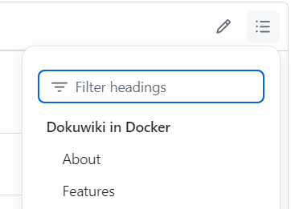

# Dokuwiki in Docker


## About
This repository contains the `Dokuwiki in Docker` image.


Get a Dokuwiki installation with a website in a single line of command.

To get a [Dokuwiki server](https://dokuwiki.org) with the [Combostrap Default Site](https://github.com/ComboStrap/site-default) at http://localhost:8080, execute:
```bash
# bash
docker run \
  --name combo-site-default \
  --rm \
  -p 8080:80 \
  -e DOKU_DOCKER_GIT_SITE='https://github.com/ComboStrap/site-default' \
  ghcr.io/combostrap/dokuwiki:php8.3-latest
```

## Table of Content

The table of content (TOC) is available at the right corner of this document.



## Features

You got out of the box:
* a default [Website](https://combostrap.com/admin/combostrap-website-5gxpcdgy)
  * You can:
    * [disable it](#disable-automatic-default-website-installation)
    * or [set your own](#set-your-combostrap-git-website)
* [Nice URL rewrite ](https://www.dokuwiki.org/rewrite)
* Performance:
  * [Php Fpm](https://www.php.net/manual/en/install.fpm.php) 
  * [OpCache](https://www.php.net/manual/en/book.opcache.php)
* [Automatic Plugins Installation](https://combostrap.com/admin/combostrap-website-yolv2qw6#plugins)
* [Last Patches](resources/dokuwiki-docker/meta/dokuwiki-patches)

## How to

### Set an admin user

By default, a site will run with the `readonly` ACL policy.
The site cannot be edited at all.

If you want to set an admin user, you need to set the following variables:
* `DOKU_DOCKER_ACL_POLICY` to `public`: the policy applied
* `DOKU_DOCKER_ADMIN_NAME` to the user admin name
* `DOKU_DOCKER_ADMIN_PASSWORD` to the user admin password
* `DOKU_DOCKER_ADMIN_EMAIL` to the user admin email (Optional)

Example:
```bash
docker run \
  --name combo-site-default \
  --rm \
  -p 8081:80 \
  -e DOKU_DOCKER_ACL_POLICY='public' \
  -e DOKU_DOCKER_ADMIN_NAME='admin' \
  -e DOKU_DOCKER_ADMIN_PASSWORD='welcome' \
  -e DOKU_DOCKER_ADMIN_NAME='admin@example.com' \
  -e DOKU_DOCKER_GIT_SITE='https://github.com/ComboStrap/site-default' \
  ghcr.io/combostrap/dokuwiki:php8.3-latest
```

The above command:
* publish the [ComboStrap default install website](https://github.com/ComboStrap/site-default)
* and configure it with the admin user:
  * name `admin`
  * password `welcome`
  * email `admin@example.com`


### Mount a Volume to backup your data

The important run parameter is the [volume](#why-the-volume-contains-a-whole-dokuwiki-installation) to keep
your data between restart.

Note: If the [volume](#why-the-volume-contains-a-whole-dokuwiki-installation) is empty, after the run, it will be filled
with a new dokuwiki installation.

Example:
* Linux / Windows WSL
```bash
cd ~/your-site
docker run \
  --name combo-site-default \
  --rm \
  -p 8080:80 \
  -v $PWD:/var/www/html \
  ghcr.io/combostrap/dokuwiki:php8.3-latest
```
* On Windows, don't bind mount a local directory as volume. See [perf](#poor-windows-perf-with-local-directory-volume-)

On a desktop, Dokuwiki would be available at: http://localhost:8080 in readonly mode.


### Choose the installed dokuwiki version

You can choose the initial [version](https://github.com/dokuwiki/dokuwiki/releases) 
to install via the `DOKUWIKI_VERSION` environment.

Example with the [2024-02-06b "Kaos" release](https://github.com/dokuwiki/dokuwiki/releases/tag/release-2024-02-06b)
```bash
docker run \
  --name combo-site-default \
  --rm \
  -p 8080:80 \
  -e DOKUWIKI_VERSION=2024-02-06b \
  -v $PWD:/var/www/html \
  ghcr.io/combostrap/dokuwiki:php8.3-latest
```

### Check if php-fpm is alive (health)

`php-fpm` has a [configuration](resources/conf/php-fpm/www.conf) `ping.path` set to `/ping`.
The response is given by the configuration `ping.response`.

Example: `http://localhost:8081/php-fpm/ping`

### Check if dokuwiki is alive (health)


Example: `http://localhost:8081/dokuwiki-docker/ping.php`

### Monitor php-fpm with status on localhost only

Example: 
```bash
docker exec -ti combo-site-default curl localhost/php-fpm/status?full
```
```
pool:                 www
process manager:      dynamic
start time:           07/Aug/2024:14:04:53 +0000
start since:          173
accepted conn:        21
listen queue:         0
max listen queue:     0
listen queue len:     4096
idle processes:       1
request method:       GET
request URI:          /php-fpm/status?full
content length:       0
user:                 -
script:               /var/www/html
last request cpu:     0.00
last request memory:  0
```

The status endpoint is available only from localhost (ie ip 127.0.0.1) for security reason
therefore you need to run it via `docker exec`

For the documentation over the data and usage, see the [configuration file](resources/conf/php-fpm/www.conf)

### Disable Automatic Default WebSite Installation

By default, this image will [install the default ComboStrap WebSite](https://combostrap.com/admin/combostrap-website-5gxpcdgy#default_website)
automatically.

To disable this behavior, you need to set the `DOKU_DOCKER_DEFAULT_SITE` environment variable to `false`

```bash
docker run -e DOKU_DOCKER_DEFAULT_SITE=false
```

### Set your ComboStrap Git WebSite


To defines the ComboStrap WebSite that this image should install, 
you need to set the `$DOKU_DOCKER_GIT_SITE` environment variable to a git URL.

```bash
docker run -e DOKU_DOCKER_GIT_SITE=https://github.com/ComboStrap/site-default.git
```

### Set in dev mode

By default, this image will run php in production mode.
You can set it in dev mode via the `DOKU_DOCKER_ENV`

```bash
docker run -e DOKU_DOCKER_ENV=dev ....
```

### Configure Php

Php can be configured via environment variables.

The convention is that you need to:
* capitilze the configuration name 
* replace all separator by `_`
* and add `PHP_` as prefix.

For instance for the `date.timezone`, you need to set the `PHP_DATE_TIMEZONE` environment.  
```bash
docker run -e PHP_DATE_TIMEZONE=UTC ....
```

All actual possibles configurations can be seen in the [php dokuwiki-docker.ini files](resources/conf/php/dokuwiki-docker.ini)

### Run as the host user

By default, the container will run as `root` but if you develop, 
you may want to change the user to the host user

You do it by setting the `user` option.

```bash
# check your ids (uid:gid should be 1000:1000)
id
# then use them
docker run \
  --user 1000:1000 \
  --rm \
  -p 8081:80 \
  ghcr.io/combostrap/dokuwiki:php8.3-latest
```

### Get a Bash Shell in the container

To get a bash shell in the container that gets the same environment that the running container
you need to create a login shell with the `-l` flag

Example:
```bash
docker exec -ti combo-site-default bash -l
```

Why? Only login shell will run the [system env script](resources/conf/bash/dokuwiki-docker-env.sh) located in `/etc/profile.d/` directory.

### Change the savedir configuration

If you want to use `data` has a namespace (ie `https://example.com/data/yourpage`), you can't 
by default because the [savedir](https://www.dokuwiki.org/config:savedir) 
is forbidden for security reasons by the [web server](resources/conf/caddy/Caddyfile)

To use `data` as a namespace, you need to
* rename the directory `data` to `dokudata`
* set the `savedir` configuration to `dokudata` in your `conf/local.php` file
```php
$conf['savedir'] = './dokudata';
```
* set the environment `DOKU_DOCKER_SAVE_DIR` to `dokudata` in a `docker run`
```bash
docker run \
  -e DOKU_DOCKER_SAVE_DIR='dokudata' \
  ghcr.io/combostrap/dokuwiki:php8.3-latest
```

Note: You can change the `dokudata` value to whatever you want.

### Update the image

We support for now only one tag by php version, therefore you need to delete the image before pulling it again

Example for `php8.3`
```bash
docker rmi ghcr.io/combostrap/dokuwiki:php8.3-latest
docker pull ghcr.io/combostrap/dokuwiki:php8.3-latest
```


## Tag 

We support for now only one tag by php version, therefore you need to [delete the image before pulling it again](#update-the-image)

```bash
php8.3-latest
```
where:
* `phpX.X` is the php version used
* `latest` is the version of this image


Dokuwiki is installed if not found on the volume.
See [how to choose the installed dokuwiki version](#choose-the-installed-dokuwiki-version)

### Components

All image contains:
* php-fpm and opcache for performance
* caddy as webserver

### Image List

The list of image is available on [GitHub](https://github.com/ComboStrap/dokuwiki-docker/pkgs/container/dokuwiki) 


## Support
### Poor Windows Perf with Local Directory Volume 

On Windows, you should not mount a windows host local directory
because it will be fucking slow.

ie `DON'T` do that
```dos
docker run ^
  -v c:\home\username\your-site:/var/www/html ^
  ghcr.io/combostrap/dokuwiki:php8.3-latest
```

Mounting a Windows folder into a Docker container is always slow no matter how you do it.
WSL2 is even slower than WSL1 in that respect.

See the [related issue](https://github.com/docker/for-win/issues/6742) that explains that this is structural.

The solution is buried into the [Docker WSL best practice](https://docs.docker.com/desktop/wsl/best-practices/)
```
It's recommended that you store source code and other data that is bind-mounted into Linux containers.
``` 

You should then:
* move the site data into the WSL Distro
* and from a Linux shell run:
```bash
docker run \
  -v ~\your-site:/var/www/html \
  ghcr.io/combostrap/dokuwiki:php8.3-latest
```

## FAQ
### Why the volume contains a whole dokuwiki installation

Why the volume contains a whole dokuwiki installation and we do not use symlink as [the official image](https://github.com/dokuwiki/docker/blob/main/root/build-setup.sh#L29)
to keep backup data as specified in the [backup](https://www.dokuwiki.org/faq:backup)

Because it's too damn hard to keep the state of an installation.
* Plugins does not use a version/release system.
* You then need to back up the `lib` directory that contains the most code.
* Configuration file may be scattered around. Example:
  * [Inter Wiki Icon](https://www.dokuwiki.org/interwiki#configuring_interwiki_shortcut_icons)
* Identification file are co-located with configuration file in the `conf` directory.
* Runtime data are mixed with persistent data into the `data` directory (ie cache/index/tmp)

If you want to keep the size low, you need to:
* perform [cleanup administrative task](https://www.dokuwiki.org/tips:maintenance).
* or to create a [site](https://combostrap.com/admin/combostrap-website-5gxpcdgy) without any volume.

### How to update the search index

```bash
php bin/indexer.php -c
```

## Other related projects

* [Official DockWiki Docker Image](https://github.com/dokuwiki/docker)